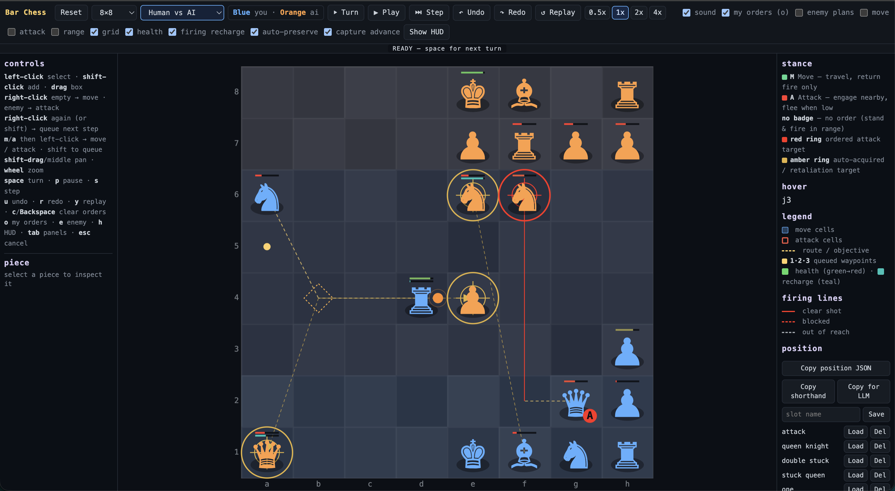
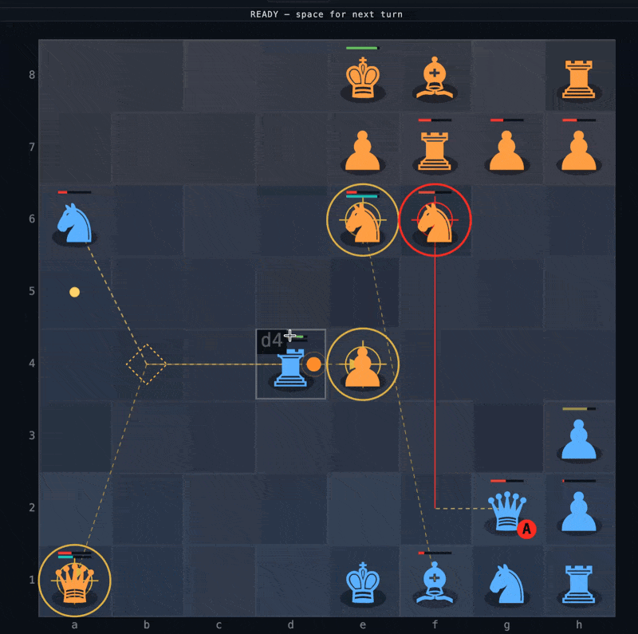

# Bar Chess

[](https://bar-chess.netlify.app/)

**Bar Chess is chess with bullets** — a chess-derived battlefield where pieces move by chess geometry and shoot visible projectiles at each other, inspired by [BAR (Beyond All Reason)](https://www.beyondallreason.info/), the open-source RTS game.



You command your pieces by giving them **intentions** (a destination or a target), then watch autonomous movement, firing, projectile flight and destruction play out. It is not chess: there are no turns, check or checkmate — chess only supplies the movement language, the piece identities and the firing geometry.

## Features

- **Chess movement, RTS combat.** Rooks slide along ranks/files, bishops along diagonals, knights leap, pawns advance and fire their forward diagonals. Every piece fires visible, travelling projectiles that can miss, be blocked or arrive late.
- **Command, don't micromanage.** Right-click to set goals; pieces work toward them and fight opportunistically. Set a persistent **stance** (Move / Attack / None) and let them engage.
- **Real-time with pause as a strategy tool.** The battle starts paused. Issue orders, then take a turn, play continuously, or replay — all playback follows the 0.5×/1×/2×/4× speed setting.
- **Turns, play bursts, undo, redo and deterministic replay.** `space` advances one turn (one move per piece, then auto-pause); `shift+space` (or **Play**) runs freely until paused, recording the burst as a **mega turn**; `u`/`r` step through the mixed turn/mega history; `y` replays the beat that produced the state you are viewing — at any point in the history, keeping your selection and place.
- **Readable overlays.** Move cells, attack cells, range arcs, paths, firing lines, health and firing-recharge bars, target rings and per-army order summaries. Automatic self-preservation retreats are drawn in bright cyan, and the piece panel labels every goal's source (manual, unreachable, self-preservation, rally, …) and tells the situation as history / now / pending. A committed engagement (AI, Attack stance or an active attack order) draws the amber reticle; a stationary None/Move piece taking an in-range "pot shot" draws a muted grey dashed line instead, and the panel says so.
- **Two kinds of attack order.** A **standing attack order** chases a target over several moves and yields to self-preservation — a hurt piece disengages, walks home to its king's healing aura, heals to about one hit above its retreat line, then resumes. An attack on a target it can never hit (say, a bishop ordered onto the opposite colour) is still approached as close as the piece's geometry allows; the route ends on the nearest reachable square with the dashed "unreachable" firing line. An **insta-kill** (immediate chess kill, when the `chess kills` rule is on and the victim is already in the ordered piece's capture pattern) is human-only, takes effect on the next tick, and outranks everything: it is pressed regardless of wounds, so a suicide kill is allowed.
- **Game modes.** Human vs AI, AI vs AI and Human vs Human.
- **Procedural audio.** WebAudio SFX driven by the event bus, with a synth editor to tweak every cue.
- **Self-preservation, bodyguards and capture-advance** make fights feel tactical rather than static.
- **King healing aura.** Pieces within two squares of their king slowly regenerate health (3× faster for human-controlled teams), drawn with a green aura and wavy healing lines (`show healing` overlay). The king is the source of the aura and does not heal itself. Badly wounded pieces walk back into the aura on their own to recover.

## Demo

<figure>
	
	<figcaption><em>Animated GIF of a demo battle, showing the UI and gameplay.</em></figcaption>
</figure>

## Installation

You don't need to install anything to play — the game is hosted at [bar-chess.netlify.app](https://bar-chess.netlify.app/). The steps below are only for running it locally from source.

Requires [Node.js](https://nodejs.org/) 20+.

```sh
npm install
```

## Running

Start the development server:

```sh
npm run dev
```

Then open the printed URL (usually http://localhost:5173) in your browser.

Production build and local preview:

```sh
npm run build
npm run preview
```

## Basic usage

The battle starts **paused**. Your team is blue (vs orange AI by default).

- **Left-click** a piece to select it; **shift-click** to add to the selection; **drag** to box-select.
- **Right-click an empty square** to order a move there (no need to micromanage the exact path — each piece advances as far as its geometry allows).
- **Right-click an enemy** to order an attack (sticky target, shown with a red ring).
- **Right-click again** (or shift-right-click) to append a step to the piece's order queue.
- A piece best-efforts goto orders even to squares it cannot reach; once it is as close as it can get, your next order replaces the spent one instead of hiding behind it. An **attack order also best-efforts an impossible target**, marching to the nearest reachable square and holding there with the dashed "unreachable" firing line until something changes. A **standing attack order yields to self-preservation**: a hurt piece hesitates, walks to your king's healing aura, heals to about one hit above its retreat line, then resumes (a critical wound stays until fully healed). An **insta-kill** attack is the one thing that overrides this and is pressed regardless of wounds.
- **`m` / `a` then left-click** forces a move / attack command; hold **Shift** to queue several.
- Set a piece's persistent **stance** from the left panel: `M` Move (travel and return fire), `A` Attack (seek and engage nearby targets), or none (stand and fire in range only).
- Press **`space`** to take a turn (or pause a play burst), **`shift+space`** to play, **`p`** to play/pause, **`s`** to step one tick.
- **Shift-drag** or **middle-drag** to pan, **wheel** to zoom. Toggle overlays in the toolbar.

The toolbar also has speed controls (0.5×–4×), sound, and `my orders` / `enemy plans` overlay scopes. The left rail shows control hints and the selected piece panel; the right rail shows the stance/legend and position export buttons.

Keyboard summary: `m`/`a` arm move/attack · `space` turn / pause play · `shift+space` play · `p` play/pause · `s` step · `u`/`r` undo/redo · `y` replay · `c`/`Backspace` clear orders · `o` my orders · `e` enemy plans · `h` HUD · `Esc` cancel.

## Development

| Command | Description |
| --- | --- |
| `npm run dev` | Vite dev server |
| `npm run build` | Type-check (`vue-tsc`) and build |
| `npm run preview` | Preview the production build |
| `npm run test` | Vitest in watch mode |
| `npm run test:run` | Run unit/render tests once |
| `npm run test:cov` | Tests with coverage |
| `npm run test:e2e` | Playwright end-to-end tests |

The design, simulation internals and roadmap are documented in [ARCHITECTURE.md](ARCHITECTURE.md) and [PLAN.md](PLAN.md).

## License

[MIT](LICENSE) © Andy Bulka
